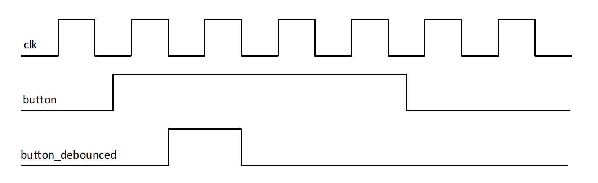
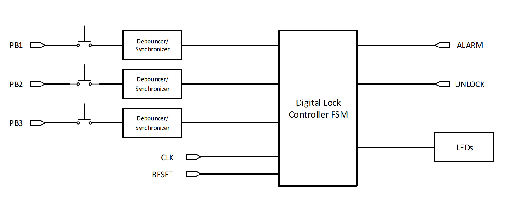

# ECE 524L Fall 2021
**California State University, Northridge**  
**Department of Electrical and Computer Engineering**  

## Lab 10 - FSM Design Digital Lock

## Objective

After completing this lab, students will be able to:
- Approach a complex FSM design problem
- Design a complex digital lock controller close to a real life application
- Implement functional simulation and verify the design on development board

## Requirements

The following material is required to complete the lab:
- Xilinx Vivado 2019.1

## References

- Xilinx FPGA datasheets (available at http://www.xilinx.com)
- Software Manual (available at https://www.xilinx.com/support.html)

## Introduction

In this lab you will use FSM design techniques in order to design, implement, and test a control circuit to control the operation of a digital lock. The digital lock to be designed in this lab is a user friendly controller that receives an input sequence (password) and if that is correct, it issues a control signal to open the lock. It also locks the lock and one must provide the correct sequence to open it again. A simple added feature is an alarm signal if one enters the wrong code. A detailed description of the digital lock is given below.

The digital lock has three push-button inputs: E (East), S (South) and W (West). The lock should have the following features:

1. When the combination S-W-E-W has been pressed, a signal UNLOCK is asserted that causes the lock to open.
2. Once the lock is open, one can close the lock by pressing any key.
3. To reset the lock to its initial state one can press the sequence E-E from any state except the reset state or when the alarm has been activated.
4. An ALARM will go off after pressing a wrong sequence of 4 buttons as long as at least one of the 4 buttons pressed is a wrong one (e.g. the sequences S-W-S-E, E-S-W-E, W-W-S-E, etc. would trigger the alarm) or if a they are entered in the wrong order.
5. The only way to recover after the alarm has been set off is by pressing the W-E sequence. This can be considered as administrator password.

Use as few states as possible without compromising the operation or security of the lock. 

## Procedure

:point_right: **Task 1:** Design of the Digital Lock FSM

1. The given design specification may not cover all possibilities. Feel free to make reasonable assumptions and state them clearly in cases that you do not see clear requirement.
2. Draw the state diagram for your digital lock (Prelab). Indicate what each state represents, what input conditions cause the state transitions, and what the corresponding outputs are. Number the state S1, S2, etc. The digital lock should have as outputs the UNLOCK and ALARM signals. In order to follow the operation of the FSM during testing, you will also show on LEDs the state number that is active. The state that corresponds to the UNLOCK and ALARM situation should be displayed as "U" and "A". You can use ASCII code equivalent of these characters to show on LEDs. It would be great if you could have the "A" blinking to draw the attention that the alarm has been set off. It is suggested that you design the state diagram as a Moore machine since that makes the timing easier.

:point_right: **Task 2:** Single pulse circuit

As part of this task you will be concentrating on implementing and testing your design. This raises some interesting issues which are mainly related to timing. In your design you have assumed that when you press the push button it will generate a single pulse which is synchronized with the clock. In reality this is not going to be the case unless you take special precautions. We are concerned with two issues:

1. **Pulse synchronization:**  
One of the complications comes from the fact that the switch will not close synchronously with the clock edge so as to ensure proper set-up and hold times for the flip-flops to which the input is connected. Synchronization can be easily ensured by passing the input signal through a clocked D flip-flop (synchronizer flip-flop).

2. **Single pulse generation when pressing the push button:**
A second problem comes from the fact that when one presses the push-button for a short moment, the time that the switch will be closed is usually much longer (msec range) than one clock period (microseconds or even nanoseconds). As a result, our digital lock (or any other finite state machine) will think that we are supplying a string of ones as the input. Thus, one needs to add a circuit after each push-button switch that will generate only one pulse every time that one presses the push-button, independent of the time one keeps the button pressed. Figure 8.1 shows the timing diagram of the push button switch where signal BUTTON is generated asynchronously while signal BUTTON_DEBOUNCED is a pulse that is in sync with the clock signal and lasts for only one clock period. Notice that the pulse BUTTON_DEBOUNCED is synchronized with the falling edge of the clock. This makes sure if this pulse is used as the input to another sequential circuit (in our case, digital lock FSM) or another flip-flop that is clocked at the positive clock edge, the set-up and hold times will be respected.

Figure 10.1 Timing diagram of the debounced push button switch 

The overall digital lock system is shown in Figure 10.2. It consists of the core FSM for the lock, together with the debouncer/synchronizer circuit for each push button input. The LEDs block is used to display the number of each state or the Alarm (A) and Unlock (U) states.

Figure 10.2 System block diagram for the digital lock

:point_right: **Task 3:** Design a circuit that generates a single pulse independent of the length of the input signal BUTTON. You can assume that the clock period is much shorter than the time the input signal BUTTON is asserted high. There are different methods to design such a circuit. These methods are covered in class lectures. Select the method of your choice to design the debouncing circuit. Notice that this circuit also takes care of the synchronization problem discussed above. In summary, you need to design the following circuits as part of the prelab work:

- State diagram for the digital lock, preliminary VHDL code for FSM
- Circuit that generates a single pulse from a push-button signal (VHDL code)

:point_right: **Task 4:** The final goal of this lab is to implement, download, display and test the digital lock whose block diagram is shown in Figure 8.2. During this lab you will design and simulate the finite state machines of the digital lock and the debouncing/synchronization circuit. As part of the second task, you will complete the top level schematic, simulate, and debug the overall circuit. Finally, you need to implement and download the circuit on an FPGA and test its operation. A demo needs to be given to your instructor to prove your design is a functional design.
	
**Make your pin assignments:**  

- You will display the UNLOCK, ALARM, and state number signals on the LEDs.
- Use push buttons for to get input from the user

Check the operation of the digital lock and observe the UNLOCK, ALARM and state signals. Check as many possible key sequences as possible to prove that the lock works properly under all conditions. Check for instance following sequences:

- Reset
- S-W-E-W: UNLOCK
- Any key: Reset State
- S-E-E: Reset State
- W-W-E-E: Reset State
- E-S-E-E: Reset State
- W-E-E: Reset State
- S-W-E-W: UNLOCK
- Any key: Reset State
- E-E-W-E: ALARM
- W-E: Reset
- S-W-S-E: ALARM
- E-S-W-W-W-E: Reset
- W-W-E-S: ALARM
- W-S-S-W-E: Reset
- E-S-W-E: ALARM
- W-S-S-W-E: Reset

If the system does not work properly check your state diagram and other circuits. Also check the constraint file and verify that your pins are being assigned to the proper pin locations. In case of design modification, implement the circuit again and download the latest version. When the circuit works successfully, prepare to give a demo to your instructor.

:point_right: **Task 5:** 

Create a video demo showing the proper functionality of your design running on the dev board.

